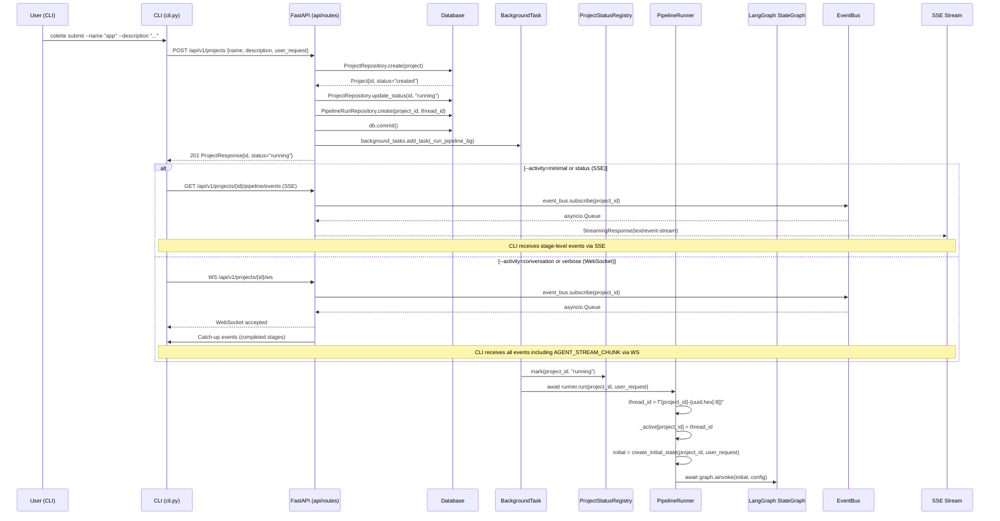
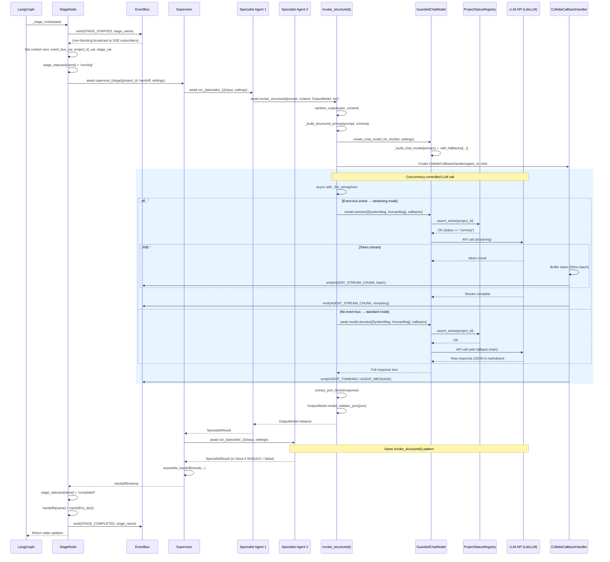
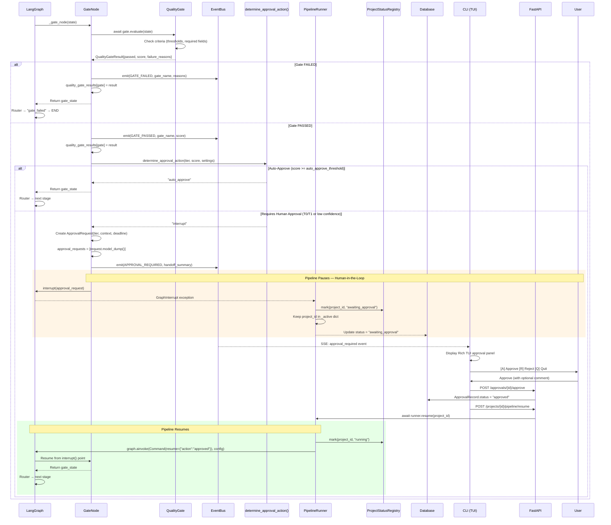
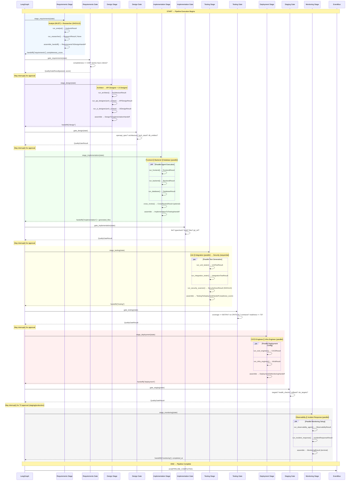
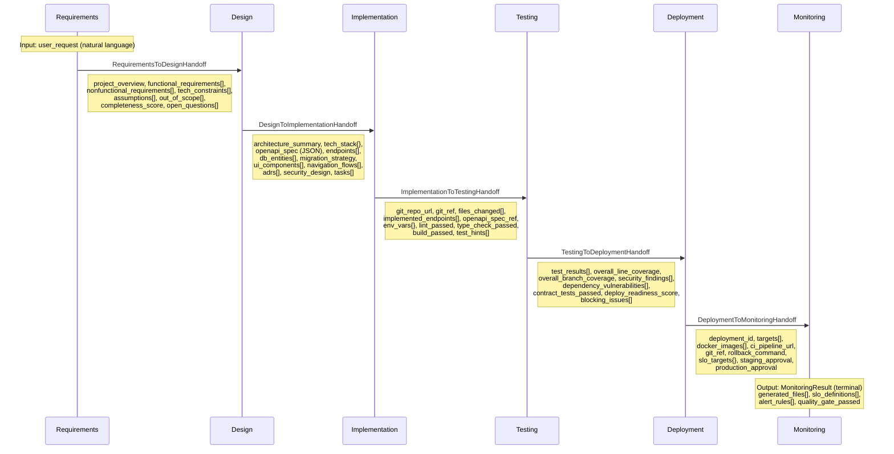
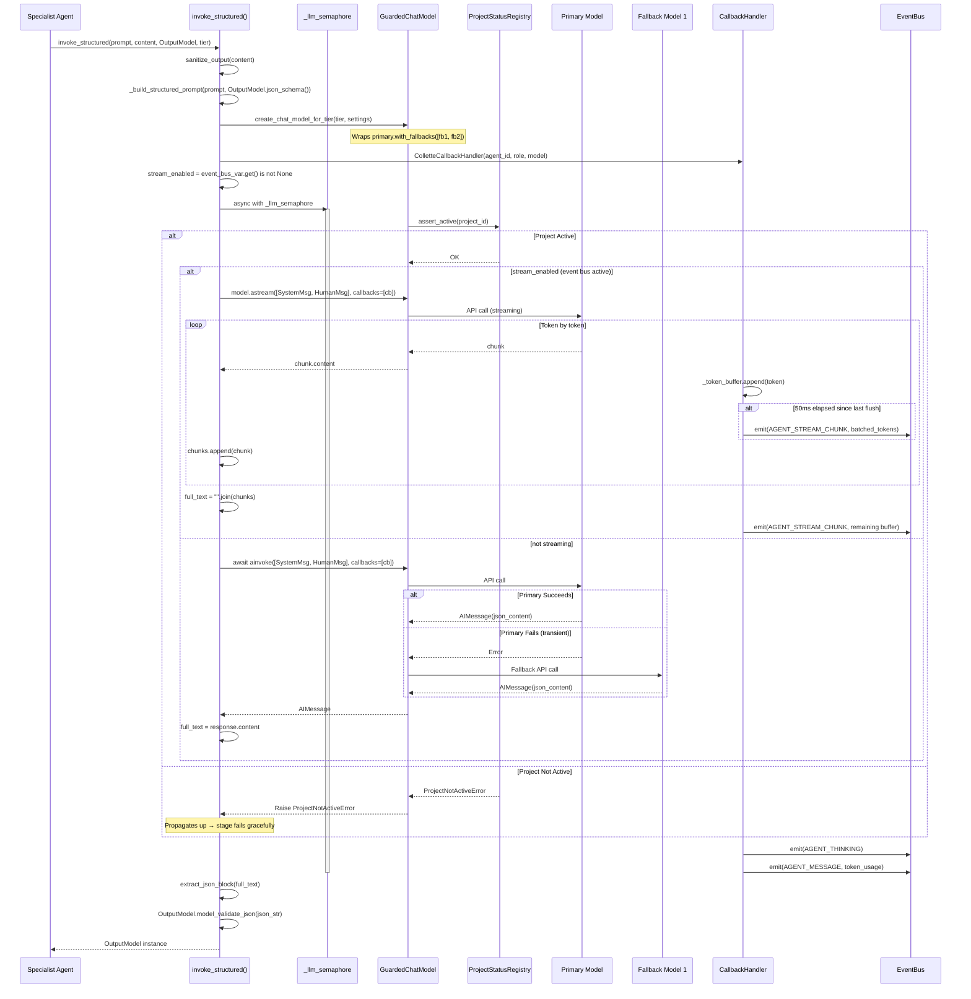
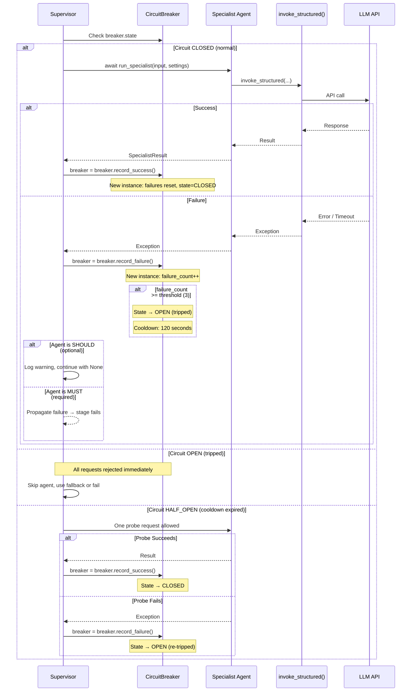

# Colette — Complete Process Sequence Diagram

## Full Pipeline Sequence (CLI Submit → Completion)



## Stage Execution Sequence (Per-Stage Pattern)



## Gate Evaluation & Approval Sequence



## Complete Pipeline Flow (All 6 Stages)



## Data Flow: Handoff Chain



## LLM Call Sequence (invoke_structured)



## Error Handling & Circuit Breaker



## Event Flow & Streaming (SSE + WebSocket)

```mermaid
sequenceDiagram
    participant Stage as Stage/Gate Node
    participant CtxVar as ContextVars
    participant CB as CallbackHandler
    participant EB as EventBus
    participant Q as asyncio.Queue
    participant SSE as SSE Generator
    participant WS as WebSocket Handler
    participant CLI as CLI (Rich TUI)

    Note over Stage,CLI: Event emission path

    Stage->>CtxVar: Set event_bus_var, project_id_var, stage_var
    Stage->>EB: emit(PipelineEvent{STAGE_STARTED, project_id, stage})

    Note over CB: During LLM calls (streaming mode)...
    CB->>CtxVar: Read event_bus_var, project_id_var
    CB->>EB: emit(PipelineEvent{AGENT_THINKING})
    loop Token streaming (50ms batches)
        CB->>EB: emit(PipelineEvent{AGENT_STREAM_CHUNK, token_batch})
    end
    CB->>EB: emit(PipelineEvent{AGENT_MESSAGE, content, tokens})

    EB->>Q: queue.put_nowait(event) for each subscriber
    Note over EB: Non-blocking; drops if queue full (1000 max)

    alt SSE Transport (minimal/status modes)
        loop SSE Event Loop
            SSE->>Q: await asyncio.wait_for(queue.get(), timeout=heartbeat)
            alt Event received
                Q-->>SSE: PipelineEvent
                SSE->>CLI: data: {event_type, stage, detail}\n\n
                CLI->>CLI: Update progress table + agent panel
            else Timeout
                SSE->>CLI: : keepalive\n\n
            end
        end
    else WebSocket Transport (conversation/verbose modes)
        loop WS Event Loop
            WS->>Q: await asyncio.wait_for(queue.get(), timeout=heartbeat)
            alt Event received
                Q-->>WS: PipelineEvent
                WS->>CLI: JSON: {event_type, agent, message, ...}
                alt AGENT_STREAM_CHUNK
                    CLI->>CLI: Append to per-agent live buffer
                    CLI->>CLI: Update Live Output panel
                else AGENT_MESSAGE
                    CLI->>CLI: Clear agent buffer, update stream log
                else Stage/Gate event
                    CLI->>CLI: Update progress table
                end
            else Timeout
                WS->>CLI: JSON: {event_type: "heartbeat"}
            end
        end
    end

    Stage->>EB: emit(PIPELINE_COMPLETED)
    EB->>Q: Final event
    Q-->>CLI: PIPELINE_COMPLETED
    CLI->>CLI: Render summary panel
    Note over SSE,WS: Unsubscribe from event bus, close transport
```

## Agent Roster Per Stage

| Stage | Agent | Role | Priority | LLM Tier | Output Type |
|-------|-------|------|----------|----------|-------------|
| **Requirements** | Analyst | Extract user stories, NFRs, constraints | MUST | PLANNING | `AnalysisResult` |
| | Researcher | Supplement with tech research | SHOULD | PLANNING | `ResearchResult` |
| **Design** | Architect | System architecture, tech stack, ADRs | MUST | PLANNING | `ArchitectureResult` |
| | API Designer | OpenAPI spec, endpoint design | MUST | EXECUTION | `APIDesignResult` |
| | UI Designer | Component specs, navigation | MUST | EXECUTION | `UIDesignResult` |
| **Implementation** | Frontend Dev | React/Next.js code generation | MUST | EXECUTION | `FrontendResult` |
| | Backend Dev | API server code generation | MUST | EXECUTION | `BackendResult` |
| | Database Eng | Migration & schema generation | MUST | EXECUTION | `DatabaseResult` |
| | Cross-Reviewer | Frontend↔Backend integration | SHOULD | VALIDATION | `CrossReviewResult` |
| **Testing** | Unit Tester | Unit test generation | MUST | EXECUTION | `UnitTestResult` |
| | Integration Tester | Integration & contract tests | MUST | EXECUTION | `IntegrationTestResult` |
| | Security Scanner | SAST + dependency scan | SHOULD | VALIDATION | `SecurityScanResult` |
| **Deployment** | CI/CD Engineer | Pipeline configs (GH Actions, etc.) | MUST | EXECUTION | `CICDResult` |
| | Infra Engineer | K8s/Docker infrastructure | MUST | EXECUTION | `InfraResult` |
| **Monitoring** | Observability Agent | Logging, metrics, dashboards | MUST | EXECUTION | `ObservabilityResult` |
| | Incident Response | Alerts, runbooks, procedures | MUST | EXECUTION | `IncidentResponseResult` |

## Gate Thresholds

| Gate | Key Criteria | Approval Tier |
|------|-------------|---------------|
| **requirements** | completeness_score >= 0.80, all stories have acceptance_criteria | T2 (moderate) |
| **design** | openapi_spec present, architecture_summary, tech_stack, db_entities | T2 (moderate) |
| **implementation** | lint_passed, type_check_passed, build_passed, files non-empty | T2 (moderate) |
| **testing** | line_coverage >= 80%, branch >= 70%, no CRITICAL, readiness >= 75 | T1 (high) |
| **staging** | targets present, health_checks, rollback, slo_targets | T1 (high) |
| **production** | staging passed + human approval | T0 (critical) |
